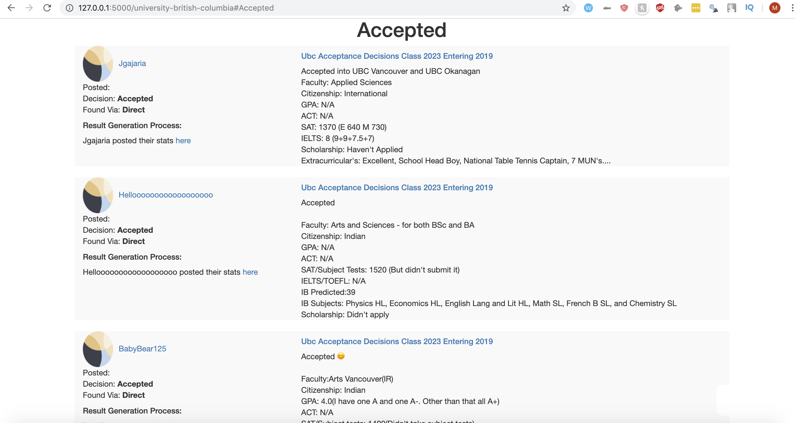

<p align="center">
  
<h5 align="center">Flask Web App that provides user with statistics to evaluate their chance of getting into a university based on College Confidential comments</h5>
</p>
x

## Motivation
As a university applicant the probability of our getting in is based on various factors such as gpa,SAT,ACT extra curriculars etc.
College Confidential is the most widely used forum/website where students look for these statistics and evaluate their chances of 
getting into the university they are applying to.Students post their application's outcome which serves as a reference point for other 
applicants.This information is very valuable to the new applicants but the process to find this information is time consuming.

<h4>Time Consuming?</h4>
Finding these stats is a hassle as if you search for a university there are
about 250 pages for each.Then each page has about 30 odd threads, each of which have about 10 pages of 20 comments on average.
It is virtually impossible to manually go through these comments.
Students might also post stats in ohter threads/forums.

For the love of Math:
This means about 1500000 comments for 1 university.

##How does this help
This program collects and categorizes College Confidential comments containing application stats and crawls College Confidential to find stats from users that post admission results and organizes them based on the University name into categories.

## How do I use this?
Create an account on
```bash
https://www.collegeconfidential.com/  
```
Get your local copy by going to terminal and 
```bash
git clone https://github.com/mridulghanshala/CollStats 
```
Open the config.py file in a editor and enter your login id and password.

Install all requirements with the following command:

```bash
$ pip install -r requirements.txt
```

Start the Flask server with the following command:

```bash
$ python app.py
```

Go to any college confidential forum, and replace the URL like so:

```bash
https://talk.collegeconfidential.com/massachusetts-institute-technology/
```

to

```bash
localhost:8080/massachusetts-institute-technology/
```

## How can I specify admission type?  (Freshman, Transfer, etc.)

Adding a "type" parameter to the URL allows you to specify admission type.  For instance:

```bash
localhost:8000/carnegie-mellon-university?type=transfer
```
or

```bash
localhost:8000/carnegie-mellon-university?type=freshman
```

Additionally, you can specify filters based on school campus  as well:

```bash
localhost:8000/university-california-berkeley?type=haas
```

## Result Generation Process

The program records the process of getting admission stats so that the user can confirm the accuracy.

In the following result, you can see the process used to get this admission result:

<p align="center">
  
</p>

In other words, PasadenaSTCA posted their admission decision in some other thread and their stats in some other thread.

##How exactly does this do this stat collection
We start by gathering all the threads on the main university pages(usually around 250).
Then we crawl through the comments(20) in each thread(about 10 pages).
If a user posts their decision and not their stats this program crawls through each poster's college confidential account to find stats that they've posted in other threads.

It turns out that doing this is computationally intensive.  For instance, pulling every Caltech University admission statistic requires searching through 9300 threads across 228 College Confidential forums.

I have utilized multithreading however the speed also depends on various factors such as Internet Speed.

## Some Use Cases

<p align="center">
  
</p>

<p align="center">
  
</p>


<p align="center">
  
</p>


<p align="center">
  
</p>


